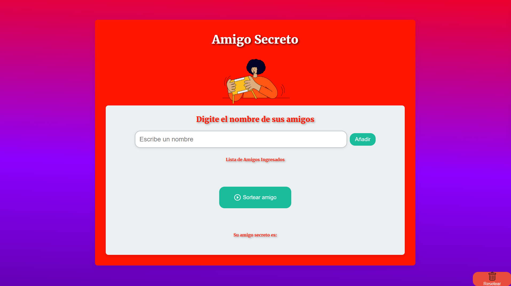

# Amigo Secreto 🎉👫
*AluraLatam & Oracle*

## Descripción ✨
**Amigo Secreto** es una aplicación web interactiva que permite a un grupo de personas organizar un sorteo de amigo secreto. Los participantes pueden agregar sus nombres, sortear los amigos secretos de manera aleatoria y ver los resultados al instante. 

Este proyecto está hecho con **HTML**, **CSS** y **JavaScript**, y tiene como objetivo proporcionar una solución divertida y dinámica para hacer sorteos de amigos secretos.

## Funcionalidades 🚀
- **Agregar amigos**: Los usuarios pueden agregar sus nombres a la lista de amigos utilizando campos de texto.
- **Sorteo aleatorio**: Realiza el sorteo de amigo secreto con solo hacer clic en el botón de **Sortear**. Los participantes serán asignados aleatoriamente a otro.
- **Resetear el sorteo**: Reiniciar la lista y empieza un nuevo juego en cualquier momento usando el botón **Reset**.

## Tecnologías utilizadas 🛠️
- **HTML5**: Estructura semántica y organización del contenido.
- **CSS3**: Estilos modernos, animaciones, y diseño responsivo.
 - **JavaScript**: Lógica para gestionar la lista de amigos y el sorteo aleatorio.

## Instalación 🔧

### 1. Abre el archivo `index.html`:
Después de clonar el repositorio, abre el archivo `index.html` en tu navegador web favorito para ver la aplicación en funcionamiento.

## Uso 📝
2. **Agregar amigos**: Ingresa los nombres de los amigos en los campos correspondientes y haz clic en **Agregar**.
3. **Sortear**: Haz clic en el botón **Sortear** para asignar aleatoriamente un amigo secreto a cada persona en la lista.
4. **Ver resultados**: Los resultados del sorteo se muestran en pantalla.
5. **Resetear**: Si deseas comenzar de nuevo, haz clic en el botón **Reset** para limpiar la lista y el sorteo.

## Capturas de pantalla 📸

## Contribuciones 🤝
Las contribuciones son siempre bienvenidas. Si encuentras algún error o tienes ideas para mejorar el proyecto, puedes hacer lo siguiente:
- **Crear un issue** para reportar un error o sugerir una mejora.
- **Hacer un pull request** con tus cambios.

## Conéctate conmigo 🌐
**Desarrollador**: Waldir Rodriguez
**GitHub**: **[walkdani]()**

